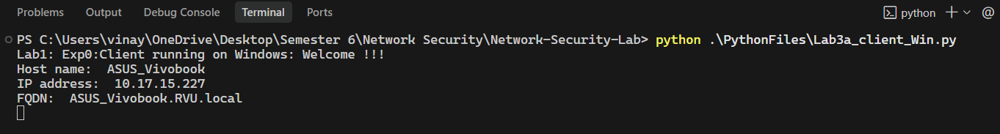
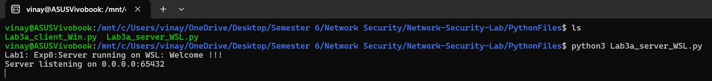
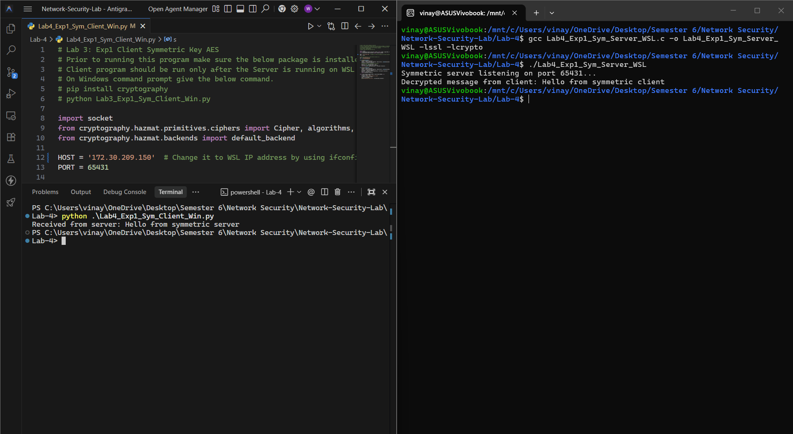
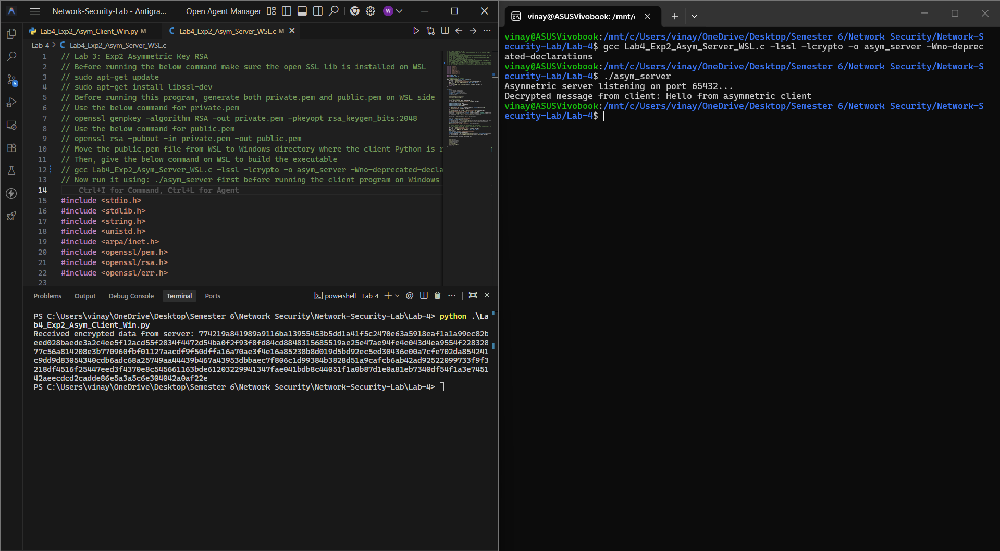

# Network-Security

Network Security lab files

## Lab 1 - CISCO Packet Tracer

Build a network with hybrid topology, using network devices (Hubs/Switches/routers) and Network Protocols (DHCP/HTTP/FTP) and ping successfully between hosts in different networks. Attach all the steps and screenshots of simulation and pinged outputs in a single pdf file with your name and USN number.


## Lab 2 - NAT

NAT


## Lab 3 - Socket Programming




## Lab 4 - Cryptography




### Implementation Details

This lab consists of two experiments: Symmetric Key Encryption (AES) and Asymmetric Key Encryption (RSA). The server runs on WSL (Ubuntu) and the client runs on Windows.

#### Prerequisites

- **WSL (Server):** Ensure OpenSSL development libraries are installed.
  ```bash
  sudo apt-get update
  sudo apt-get install libssl-dev
  ```
- **Windows (Client):** Install the `cryptography` Python library.
  ```powershell
  pip install cryptography
  ```

#### Experiment 1: Symmetric Key Encryption (AES)

1.  **WSL (Server):** Compile and run the server.
    ```bash
    gcc Lab4_Exp1_Sym_Server_WSL.c -lssl -lcrypto -o sym_server
    ./sym_server
    ```
2.  **Windows (Client):** Update the `HOST` variable in `Lab4_Exp1_Sym_Client_Win.py` with your WSL IP address (found using `ifconfig` in WSL). Then run:
    ```powershell
    python Lab4_Exp1_Sym_Client_Win.py
    ```

#### Experiment 2: Asymmetric Key Encryption (RSA)

1.  **WSL (Server):** Generate the public and private keys.
    ```bash
    openssl genpkey -algorithm RSA -out private.pem -pkeyopt rsa_keygen_bits:2048
    openssl rsa -pubout -in private.pem -out public.pem
    ```
2.  **WSL (Server):** Compile and run the server.
    ```bash
    gcc Lab4_Exp2_Asym_Server_WSL.c -lssl -lcrypto -o asym_server -Wno-deprecated-declarations
    ./asym_server
    ```
3.  **Windows (Client):** Ensure `public.pem` is in the same directory as the client script. Update the `HOST` variable in `Lab4_Exp2_Asym_Client_Win.py` with your WSL IP address. Then run:
    ```powershell
    python Lab4_Exp2_Asym_Client_Win.py
    ```
