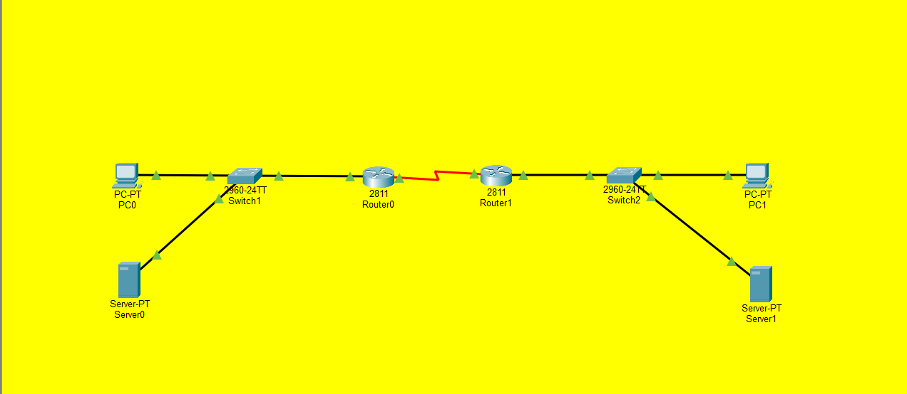
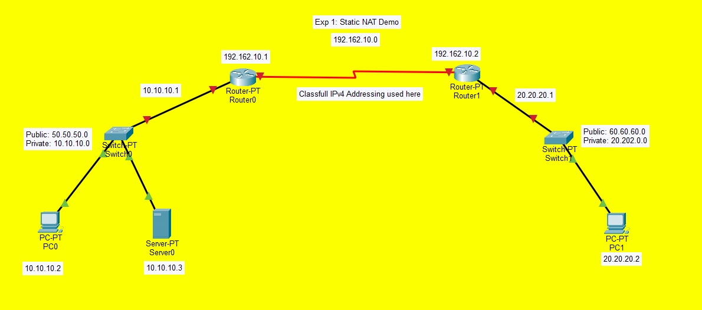

# Network-Security
Network Security lab files

## Lab 1 - CISCO Packet Tracer  
Build a network with hybrid topology, using network devices (Hubs/Switches/routers) and Network Protocols (DHCP/HTTP/FTP) and ping successfully between hosts in different networks. Attach all the steps and screenshots of simulation and pinged outputs in a single pdf file with your name and USN number.

## Lab 2 - NAT
NAT

